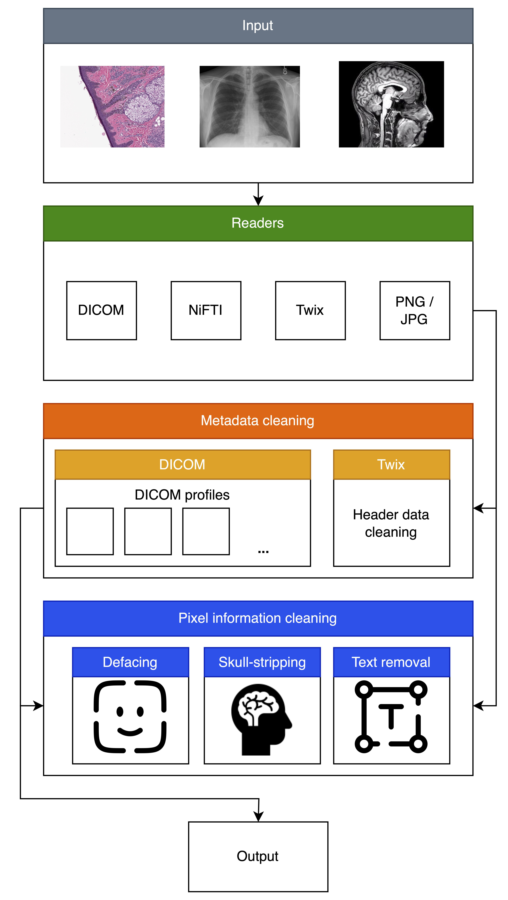
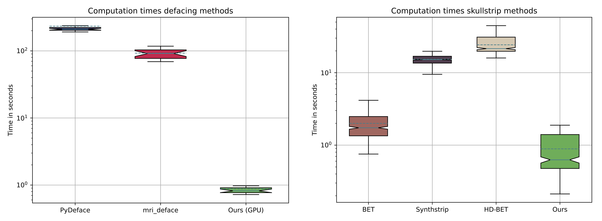

# De-Identification of Medical Imaging Data: A Comprehensive Tool for Ensuring Patient Privacy

[](https://www.python.org/downloads/release/python-3120/) 
[](https://github.com/psf/black)
[](./LICENSE)
![Open Source Love][0c]
[](https://hub.docker.com/r/morrempe/hold)


<div align="center">

[0c]: https://badges.frapsoft.com/os/v2/open-source.svg?v=103

[Getting Started](#getting-started) • [Usage](#usage) • [Citation](#citation)

</div>

---

> [!IMPORTANT]  
> The package is now available on PyPI: `pip install mede`

> [!NOTE]  
> MEDE now supports the _Enhanced DICOM_ format!

---

This repository contains the **De-Identification of Medical Imaging Data: A Comprehensive Tool for Ensuring Patient Privacy**, which enables users to anonymize a wide variety of medical imaging types, including:

- Magnetic Resonance Imaging (MRI)
- Computer Tomography (CT)
- Ultrasound (US)
- Whole Slide Images (WSI)
- MRI raw data (twix)

<div align="center">



</div>

This tool combines multiple anonymization steps, including **metadata deidentification**, **defacing**, and **skull-stripping**, while being faster than current state-of-the-art deidentification tools.



---

## Getting Started

You can install the anonymization tool directly via **pip** or **Docker**.

### Installation via pip

Our tool is available via pip. You can install it with the following command:

```bash
pip install mede
```

#### Additional Dependencies for Text Removal

> [!WARNING]  
> Since version 0.0.11 we use [EasyOCR](https://github.com/JaidedAI/EasyOCR) instead of Tesseract for text removal. If you want to use the text removal feature, you need to install EasyOCR and its dependencies. EasyOCR is installed automatically with the newer version of MEDE.

We also implement a manual text removal feature that can be used to remove any remaining text from the images. This feature is optional and can be enabled with the additional `--refine` flag. 
This will open an interactive window where you can manually select any remaining text/artifacts and remove them by drawing a bounding box around them. 

To draw a bounding box, click and hold the left mouse button, drag to create a rectangle around the text/artifact you want to remove, and then release the mouse button. The selected area will be filled with black pixels to effectively remove the text/artifact from the image.

To reset the image to its original state, press the `r` key while the interactive window is open. 

To save the changes, press `space` or `enter`. 

---

The following installation is only necessary if you want to use the old text removal feature and have an older version of MEDE installed:

If you want to use the old text removal feature, you also need to install Google's Tesseract OCR engine. Follow the installation instructions for your operating system [here](https://tesseract-ocr.github.io/tessdoc/Installation.html).

- **On Ubuntu**:
  ```bash
  sudo apt install tesseract-ocr
  sudo apt install libtesseract-dev
  ```

- **On macOS** (via Homebrew):
  ```bash
  brew install tesseract
  ```

---

### Installation via Docker

Alternatively, this tool is distributed via Docker. You can find the Docker images [here](https://hub.docker.com/repository/docker/morrempe/mede/). The Docker image is available for Linux-based (including macOS) `amd64` and `arm64` platforms.

#### Steps:

1. **Pull the Docker image**:
   ```bash
   docker pull morrempe/mede:[tag]   # Replace [tag] with either arm64 or amd64
   ```

2. **Run the Docker container with an attached volume**:  
   Your data will be mounted in the `data` folder:
   ```bash
   docker run --rm -it -v [Path/to/your/data]:/data morrempe/mede:[tag]
   ```

3. **Run the script with the corresponding CLI parameters**:
   ```bash
   mede-deidentify [your flags]
   ```

---

## Usage

### De-Identification CLI

The `mede-deidentify` command-line interface (CLI) allows you to de-identify medical imaging data with various options. Below is the detailed usage guide:

```bash
mede-deidentify [-h] [-v | --verbose] [-t | --text-removal] [-i | --input]
                [-o OUTPUT] [--gpu] [-s | --skull_strip] [-de | --deface]
                [-tw | --twix] [-w | --wsi] [-r | --rename]
                [-p PROCESSES] 
                [-d {basicProfile,cleanDescOpt,cleanGraphOpt,cleanStructContOpt,
                     rtnDevIdOpt,rtnInstIdOpt,rtnLongFullDatesOpt,
                     rtnLongModifDatesOpt,rtnPatCharsOpt,rtnSafePrivOpt,
                     rtnUIDsOpt} ...]
```

### Options

| **Option** | **Description**                                                                                     |
|------------|-----------------------------------------------------------------------------------------------------|
| `-h, --help` | Show the help message and exit.                                                                    |
| `-v, --verbose` | Enable verbose output.                                                 |
| `-i INPUT, --input INPUT` | Path to the input data.                                                               |
| `-o OUTPUT, --output OUTPUT` | Path to save the output data.                                                      |
| `--gpu GPU` | Specify the GPU device number (default: `0`).                                                       |
| `-s, --skull_strip` | Perform skull stripping.                                                                     |
| `-de, --deface` | Perform defacing.                                                                                |
| `-tw, --twix` | Process MRI raw data (twix format) and anonymize metadata.                                                               |
| `-w, --wsi` | Process Whole Slide Images (WSI).                                                                   |
| `-t, --text-removal` | Perform text removal.                                          |
| `--refine` | Enable interactive refinement of text removal results.                                          |
| `-r, --rename` | Rename files during processing.                                                                  |
| `-p PROCESSES, --processes PROCESSES` | Number of processes to use for multiprocessing.                            |
| `-d, --deidentification-profile` | Specify one or more DICOM deidentification profiles to apply (see below).       |

---

### De-Identification Profiles

The `-d` or `--deidentification-profile` option allows you to specify one or more DICOM deidentification profiles. Available profiles include:

- `basicProfile`
- `cleanDescOpt`
- `cleanGraphOpt`
- `cleanStructContOpt`
- `rtnDevIdOpt`
- `rtnInstIdOpt`
- `rtnLongFullDatesOpt`
- `rtnLongModifDatesOpt`
- `rtnPatCharsOpt`
- `rtnSafePrivOpt`
- `rtnUIDsOpt`

You can specify multiple profiles by separating them with spaces. For example:

```bash
mede-deidentify -d basicProfile cleanDescOpt
```

---

### Example Usage

Here’s an example of how to use the CLI:

```bash
mede-deidentify -i /path/to/input -o /path/to/output -s -d basicProfile
```

This command will:

1. Take input data from `/path/to/input`.
2. Save the output to `/path/to/output`.
3. Apply skull stripping.
4. Use the `basicProfile` deidentification profile.

---

## Citation

If you use our tool in your work, please cite us with the following BibTeX entry.

```latex
@article{rempe2025identification,
  title={De-identification of medical imaging data: a comprehensive tool for ensuring patient privacy},
  author={Rempe, Moritz and Heine, Lukas and Seibold, Constantin and H{\"o}rst, Fabian and Kleesiek, Jens},
  journal={European Radiology},
  pages={1--10},
  year={2025},
  publisher={Springer}
}
```
